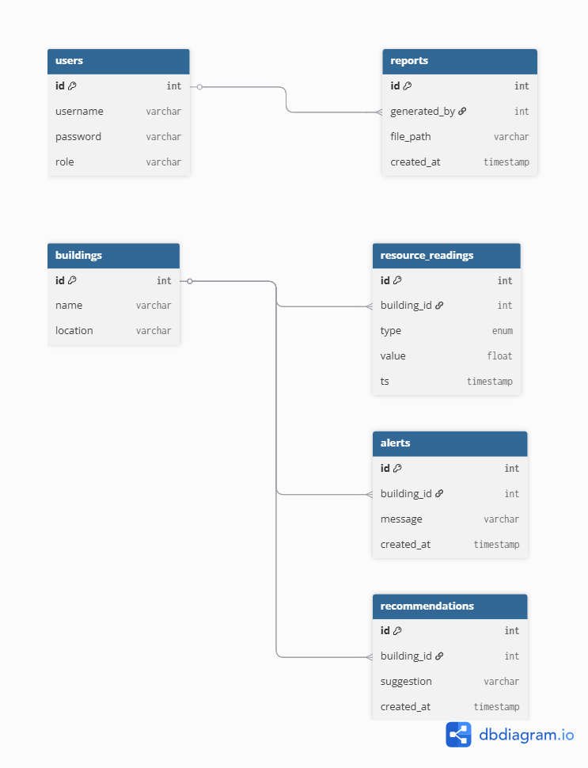

# Data Model Documentation

## Overview
The system uses a relational database design with six core entities: users, buildings, resource_readings, alerts, reports, and recommendations. These entities support all major system functionalities including dashboards, alerts, and reporting.

## Entities

- **Users**: Stores authentication and role information (admin, facility_manager, student).
- **Buildings**: Represents campus buildings across multiple institutions.
- **Resource_Readings**: Stores time-series sustainability data (energy, water, waste, CO2) for each building.
- **Alerts**: Stores generated alerts linked to buildings.
- **Reports**: Stores generated reports and their metadata.
- **Recommendations**: Stores optimization suggestions per building.

## Relationships

- One building → many resource_readings  
- One building → many alerts  
- One building → many recommendations  
- One user → many reports  

## Design Decision

The `resource_readings` table is designed as a separate time-series table instead of embedding data within buildings. This allows efficient storage and querying of historical data, which is essential for generating trends and analytics.

## ER Diagram / UML Class Diagram

The following diagram represents the database schema and relationships between entities. It also serves as the UML class diagram since SQLAlchemy models directly map to object-oriented classes.

