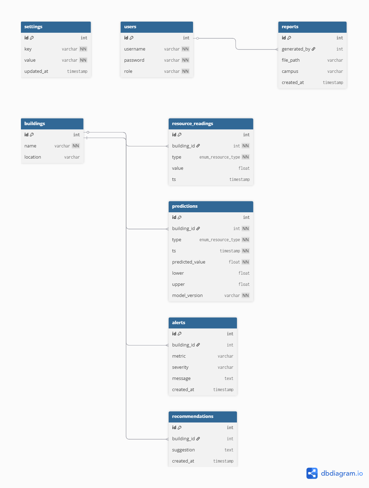

# Data Model Documentation

## Overview

The system uses a relational database design to support campus sustainability monitoring, dashboard metrics, alerts, reporting, recommendations, settings, and forecast storage.

The main entities are users, buildings, resource_readings, alerts, reports, recommendations, settings, and predictions.

## Entities

* **Users**: Stores authentication and role information such as admin, facility manager, and student.
* **Buildings**: Stores campus building metadata such as building name and location.
* **Resource_Readings**: Stores timestamped sustainability readings for each building. Supported resource types are energy, water, waste, and CO2.
* **Predictions**: Stores forecast outputs for each building and resource type.
* **Alerts**: Stores generated alerts linked to buildings.
* **Reports**: Stores generated reports and their metadata.
* **Recommendations**: Stores optimization suggestions per building.
* **Settings**: Stores configurable key-value settings used by the backend.

## Relationships

* One building → many resource_readings
* One building → many predictions
* One building → many alerts
* One building → many recommendations
* One user → many reports

## Design Decisions

The `resource_readings` table is designed as a separate time-series table instead of embedding readings directly inside the `buildings` table. This supports historical trends, dashboard queries, and forecasting workflows.

A composite index is added on:

```text
resource_readings(building_id, type, ts)
```

This improves query performance for time-series lookups by building, resource type, and timestamp.

The `predictions` table stores forecast results separately from actual readings. Each prediction includes the building, resource type, timestamp, predicted value, optional lower and upper bounds, and model version. This allows forecast results to be retrieved without recomputing predictions on every request.

Weather readings can be added in a future extension to improve forecasting with temperature and humidity context.

## ER Diagram / UML Class Diagram

The following diagram represents the database schema and relationships between entities. It also serves as the UML class diagram since SQLAlchemy models directly map to object-oriented classes.

